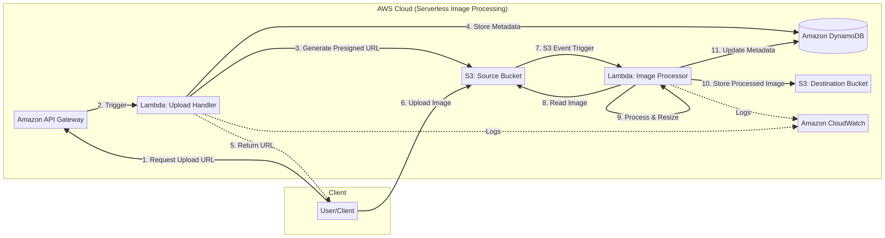

# [cite_start]Serverless Image Processing with S3 and Lambda [cite: 1]

## Project Description
This project implements a serverless image processing application on AWS. [cite_start]Users upload images to an S3 bucket, which automatically triggers an AWS Lambda function to resize them and store them in a separate bucket [cite: 3-5].

## Architecture Diagram
 
[cite_start]*(Note: Upload the image file to your repository and reference it here [cite: 7-8])*

## [cite_start]Workflow Explanation [cite: 29]
1. [cite_start]**Upload:** Client requests a pre-signed URL via API Gateway to securely upload an image [cite: 31-33].
2. [cite_start]**Trigger:** S3 triggers the Image Processor Lambda function upon a new upload[cite: 36].
3. [cite_start]**Process:** Lambda downloads the image, resizes it using the Pillow library, and uploads it to the destination bucket [cite: 38-40].
4. [cite_start]**Metadata:** Image details (size, status, timestamps) are stored in Amazon DynamoDB[cite: 41, 43].
5. [cite_start]**Logs:** All operations are monitored via Amazon CloudWatch[cite: 44].

## [cite_start]Key AWS Services Used [cite: 45]
* [cite_start]**Amazon S3**: Scalable storage for original and processed images[cite: 46].
* [cite_start]**AWS Lambda**: Serverless compute for processing logic[cite: 47].
* [cite_start]**Amazon DynamoDB**: NoSQL database for image metadata[cite: 49].
* [cite_start]**Amazon API Gateway**: REST endpoint for secure client interaction[cite: 48].
* [cite_start]**AWS IAM**: Secure access management via least-privilege roles[cite: 50].

## [cite_start]How to Deploy [cite: 81]
1. [cite_start]**Infrastructure**: Use the provided Terraform configuration to provision AWS resources [cite: 74-75].
2. [cite_start]**Lambda Package**: Package the Python code with the Pillow library[cite: 92, 148].
3. [cite_start]**Environment Variables**: Configure `DESTINATION_S3_BUCKET` and `DYNAMODB_TABLE_NAME` in Lambda settings[cite: 107, 129].

## [cite_start]Best Practices [cite: 65]
* [cite_start]**Decoupling**: Separation of upload and processing tasks[cite: 61].
* [cite_start]**Security**: Use of IAM roles and S3 pre-signed URLs [cite: 66-67].
* [cite_start]**Scalability**: Fully serverless components that scale automatically[cite: 68].
